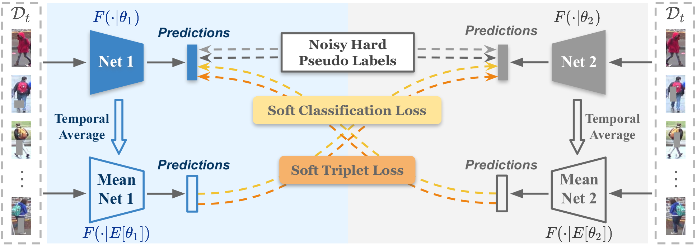
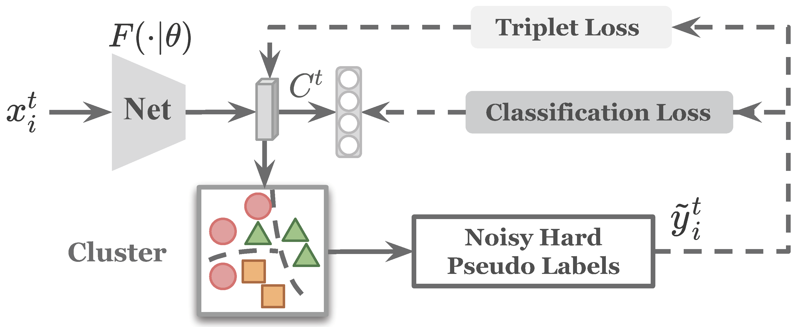
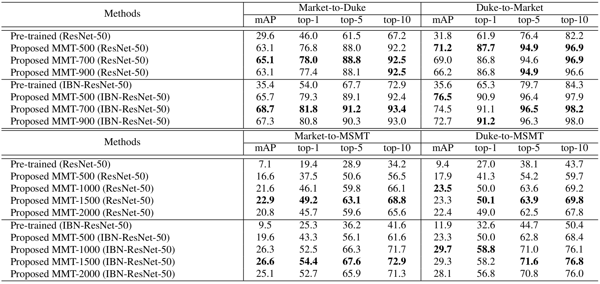

# Mutual Mean-Teaching (MMT)

The *official* implementation for the [Mutual Mean-Teaching: Pseudo Label Refinery for Unsupervised Domain Adaptation on Person Re-identification](https://openreview.net/forum?id=rJlnOhVYPS) which is accepted by [ICLR-2020](https://iclr.cc).



## What's New
#### [Jul 1st, 2020]
+ We did the code refactoring to support distributed training and more features. Please see [OpenUnReID](https://github.com/open-mmlab/OpenUnReID).

#### [Mar 27th, 2020]
+ We wrote a Chinese blog about this paper at [[Zhihu]](https://zhuanlan.zhihu.com/p/116074945).

#### [Mar 20th, 2020]
+ We supported **DBSCAN-based MMT** which could achieve better performance. *Note that* we effectively accelerated the Jaccard distance computing process for DBSCAN (around 200s for CPU and 60s for GPU, compared to around 10min in other repos). 
+ We added the **general clustering-based baseline** training for UDA re-ID, i.e. single model training with only hard pseudo labels. 
+ We slightly modified the setting of training iterations `--iters` from  `800` to `400` in the training scripts, achieving similar performance with less time cost.
+ We discovered **a minor hint**, changing the setting of `--dropout` from `0` to `0.5` will achieve supervising improvements in MMT. Intuitively, the dual models are more de-coupled with independent dropout functions.
+ A reminder here, changing the hyper-parameter `--soft-tri-weight 0.8` to `--soft-tri-weight 1.0` may achieve better performance in some cases. Please refer to ablation study results in Table 2 in our paper.


## Installation

```shell
git clone https://github.com/yxgeee/MMT.git
cd MMT
python setup.py install
```

## Prepare Datasets

```shell
cd examples && mkdir data
```
Download the raw datasets [DukeMTMC-reID](https://arxiv.org/abs/1609.01775), [Market-1501](https://www.cv-foundation.org/openaccess/content_iccv_2015/papers/Zheng_Scalable_Person_Re-Identification_ICCV_2015_paper.pdf), [MSMT17](https://arxiv.org/abs/1711.08565),
and then unzip them under the directory like
```
MMT/examples/data
├── dukemtmc
│   └── DukeMTMC-reID
├── market1501
│   └── Market-1501-v15.09.15
└── msmt17
    └── MSMT17_V1
```

## Prepare Pre-trained Models
When *training with the backbone of [IBN-ResNet-50](https://arxiv.org/abs/1807.09441)*, you need to download the [ImageNet](http://www.image-net.org/) pre-trained model from this [link](https://drive.google.com/drive/folders/1thS2B8UOSBi_cJX6zRy6YYRwz_nVFI_S) and save it under the path of `logs/pretrained/`.
```shell
mkdir logs && cd logs
mkdir pretrained
```
The file tree should be
```
MMT/logs
└── pretrained
    └── resnet50_ibn_a.pth.tar
```

## Example #1:
Transferring from [DukeMTMC-reID](https://arxiv.org/abs/1609.01775) to [Market-1501](https://www.cv-foundation.org/openaccess/content_iccv_2015/papers/Zheng_Scalable_Person_Re-Identification_ICCV_2015_paper.pdf) on the backbone of [ResNet-50](https://arxiv.org/abs/1512.03385), *i.e. Duke-to-Market (ResNet-50)*.

### Train
We utilize 4 GTX-1080TI GPUs for training.

**An explanation about the number of GPUs and the size of mini-batches:**
+ We adopted 4 GPUs with a batch size of 64, since we found 16 images out of 4 identities in a mini-batch benefits the learning of BN layers, achieving optimal performance. This setting may affect IBN-ResNet-50 in a larger extent.
+ It is fine to try other hyper-parameters, i.e. GPUs and batch sizes. I recommend to remain a mini-batch of 16 images for the BN layers, e.g. use a batch size of 32 for 2 GPUs training, etc.

#### Stage I: Pre-training on the source domain

```shell
sh scripts/pretrain.sh dukemtmc market1501 resnet50 1
sh scripts/pretrain.sh dukemtmc market1501 resnet50 2
```

#### Stage II: End-to-end training with MMT-500 
We utilized K-Means clustering algorithm in the paper.

```shell
sh scripts/train_mmt_kmeans.sh dukemtmc market1501 resnet50 500
```

We supported DBSCAN clustering algorithm currently.
**Note that** you could add `--rr-gpu` in the training scripts for faster clustering but requiring more GPU memory.

```shell
sh scripts/train_mmt_dbscan.sh dukemtmc market1501 resnet50
```

### Test
We utilize 1 GTX-1080TI GPU for testing.
Test the trained model with best performance by
```shell
sh scripts/test.sh market1501 resnet50 logs/dukemtmcTOmarket1501/resnet50-MMT-500/model_best.pth.tar
```


## Other Examples:
**Duke-to-Market (IBN-ResNet-50)**
```shell
# pre-training on the source domain
sh scripts/pretrain.sh dukemtmc market1501 resnet_ibn50a 1
sh scripts/pretrain.sh dukemtmc market1501 resnet_ibn50a 2
# end-to-end training with MMT-500
sh scripts/train_mmt_kmeans.sh dukemtmc market1501 resnet_ibn50a 500
# or MMT-700
sh scripts/train_mmt_kmeans.sh dukemtmc market1501 resnet_ibn50a 700
# or MMT-DBSCAN
sh scripts/train_mmt_dbscan.sh dukemtmc market1501 resnet_ibn50a 
# testing the best model
sh scripts/test.sh market1501 resnet_ibn50a logs/dukemtmcTOmarket1501/resnet_ibn50a-MMT-500/model_best.pth.tar
sh scripts/test.sh market1501 resnet_ibn50a logs/dukemtmcTOmarket1501/resnet_ibn50a-MMT-700/model_best.pth.tar
sh scripts/test.sh market1501 resnet_ibn50a logs/dukemtmcTOmarket1501/resnet_ibn50a-MMT-DBSCAN/model_best.pth.tar
```
**Duke-to-MSMT (ResNet-50)**
```shell
# pre-training on the source domain
sh scripts/pretrain.sh dukemtmc msmt17 resnet50 1
sh scripts/pretrain.sh dukemtmc msmt17 resnet50 2
# end-to-end training with MMT-500
sh scripts/train_mmt_kmeans.sh dukemtmc msmt17 resnet50 500
# or MMT-1000
sh scripts/train_mmt_kmeans.sh dukemtmc msmt17 resnet50 1000
# or MMT-DBSCAN
sh scripts/train_mmt_dbscan.sh dukemtmc market1501 resnet50 
# testing the best model
sh scripts/test.sh msmt17 resnet50 logs/dukemtmcTOmsmt17/resnet50-MMT-500/model_best.pth.tar
sh scripts/test.sh msmt17 resnet50 logs/dukemtmcTOmsmt17/resnet50-MMT-1000/model_best.pth.tar
sh scripts/test.sh msmt17 resnet50 logs/dukemtmcTOmsmt17/resnet50-MMT-DBSCAN/model_best.pth.tar
```

## General Clustering-based Baseline Training
<div align=center></div>

**Note that the baseline mentioned in our paper is slightly different from the general clustering-based baseline:**
+ For fair comparison in the ablation study, the baseline in our paper utilized the same dual-model framework as our MMT but using only hard pseudo labels (no soft labels and no mean-teachers), i.e. setting `--soft-ce-weight 0 --soft-tri-weight 0 --alpha 0` in the training scripts.
+ The general clustering-based baseline is illustrated as above, which contains only one model. The model is training with a cross-entropy loss and a triplet loss, supervised by hard pseudo labels.
+ Although the baseline in our paper adopted dual models that are *independently* trained with hard losses, the features extracted for clustering are averaged from dual models. It is **the only difference** from the general clustering-based baseline.

Here, we supported training with the general clustering-based baseline for further academic usage.
For example, Duke-to-Market with ResNet-50
```shell
# for K-Means
sh scripts/train_baseline_kmeans.sh dukemtmc market1501 resnet50 500
sh scripts/train_baseline_kmeans.sh dukemtmc market1501 resnet50 700
sh scripts/train_baseline_kmeans.sh dukemtmc market1501 resnet50 900
# for DBSCAN
sh scripts/train_baseline_dbscan.sh dukemtmc market1501 resnet50 
```


## Download Trained Models
*Source-domain pre-trained models and all our MMT models in the paper can be downloaded from the [link](https://drive.google.com/open?id=1WC4JgbkaAr40uEew_JEqjUxgKIiIQx-W).*



## Citation
If you find this code useful for your research, please cite our paper
```
@inproceedings{
  ge2020mutual,
  title={Mutual Mean-Teaching: Pseudo Label Refinery for Unsupervised Domain Adaptation on Person Re-identification},
  author={Yixiao Ge and Dapeng Chen and Hongsheng Li},
  booktitle={International Conference on Learning Representations},
  year={2020},
  url={https://openreview.net/forum?id=rJlnOhVYPS}
}
```
